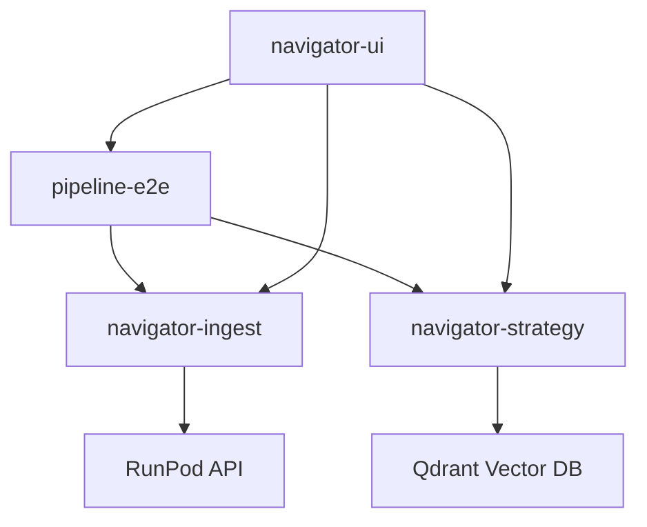

# SpiceflowNavigator Development Guide

## Architecture Overview

SpiceflowNavigator uses a **4-agent monorepo architecture** designed to enable parallel development by independent AI agents without merge conflicts.

### High-Level Structure

```
spiceflow/
├── apps/
│   ├── pipeline-e2e/          # Agent 1 – End-to-end orchestrator
│   ├── navigator-ingest/      # Agent 2 – RSS ingest & Whisper jobs
│   ├── navigator-strategy/    # Agent 3 – Goal-scoring, delta analysis
│   └── navigator-ui/          # Agent 4 – Streamlit/Next.js front-end
├── libs/
│   ├── common-utils/          # Logging, retry, telemetry decorators
│   ├── embeddings/            # Wrapper for pgvector/qdrant clients
│   └── eval-harness/          # RAGAS tests, scoring metrics
├── infrastructure/
│   ├── docker/                # Compose files, Dockerfiles
│   ├── runpod/                # runpod.yaml + startup.sh
│   └── github/                # CI/CD workflows
└── docs/
    └── DEV_GUIDE.md           # This file
```

## Agent Responsibilities

### Agent 1: Pipeline E2E (`apps/pipeline-e2e/`)
- **Purpose**: End-to-end orchestrator that coordinates the entire pipeline
- **Responsibilities**:
  - Reads user goals from `/Goals/` directory
  - Triggers RSS ingestion through navigator-ingest API
  - Calls navigator-strategy for analysis and scoring
  - Produces final weekly briefs in markdown format
- **API Contract**: Exposes gRPC method `RunFullPipeline(goals_md, podcast_yaml) → brief_md`

### Agent 2: Navigator Ingest (`apps/navigator-ingest/`)
- **Purpose**: RSS monitoring, audio fetching, and Whisper transcription via RunPod
- **Responsibilities**:
  - Monitors RSS feeds for new episodes
  - Downloads audio files from podcast URLs
  - Submits audio to RunPod for Whisper transcription
  - Stores transcripts and metadata
- **API Contract**: 
  - `POST /ingest?rss_id=...` - Trigger ingestion for RSS feed
  - `GET /transcript/{id}` - Retrieve transcript by ID

### Agent 3: Navigator Strategy (`apps/navigator-strategy/`)
- **Purpose**: Hybrid search, goal-relevance scoring, and delta analysis
- **Responsibilities**:
  - Performs hybrid search (cosine + BM25) on transcripts
  - Scores content relevance against user goals
  - Detects deltas (changes week-over-week)
  - Returns top-N snippets with source attributions
- **API Contract**: `POST /score` (payload: transcripts, goals) → scored snippets

### Agent 4: Navigator UI (`apps/navigator-ui/`)
- **Purpose**: User-facing Streamlit/Next.js interface
- **Responsibilities**:
  - Upload and manage user goals
  - Display weekly briefs and insights
  - Show relevance heatmaps and visualizations
  - Collect user feedback
  - (Future) Authentication and billing
- **API Contract**: Calls gRPC (RunFullPipeline) or hits ingest + strategy endpoints directly

## Development Workflow

### Branch & Folder Isolation Rules

| Rule | Implementation |
|------|----------------|
| One feature-branch = one agent ticket | `ingest/agent-42/add-rss-parsers`, `strategy/agent-17/tune-hybrid-search` |
| Sparse checkout inside each sandbox | `git sparse-checkout set apps/navigator-ingest libs/common-utils` |
| Path-scoped CODEOWNERS | Automatic review routing based on changed files |
| Branch protection | Require review from CODEOWNERS, restrict pushes to main |

### Local Development Commands

```bash
# Install all dependencies
make install-deps

# Run specific agents
make dev-e2e        # End-to-end pipeline
make dev-ingest     # RSS monitoring and transcription
make dev-strategy   # Analysis and scoring
make dev-ui         # User interface

# Run tests
make test-all       # All tests
pytest apps/pipeline-e2e/tests/      # Specific agent tests
pytest apps/navigator-ingest/tests/
pytest apps/navigator-strategy/tests/
pytest apps/navigator-ui/tests/
```

### Sparse Checkout for Agent Isolation

Each agent should use sparse checkout to only work on their assigned folders:

```bash
# For navigator-ingest agent
git sparse-checkout init --cone
git sparse-checkout set apps/navigator-ingest libs/common-utils

# For navigator-strategy agent  
git sparse-checkout init --cone
git sparse-checkout set apps/navigator-strategy libs/embeddings libs/eval-harness

# For navigator-ui agent
git sparse-checkout init --cone
git sparse-checkout set apps/navigator-ui libs/common-utils

# For pipeline-e2e agent
git sparse-checkout init --cone
git sparse-checkout set apps/pipeline-e2e libs/common-utils
```

## Integration Contracts

### API Boundaries Between Agents



### Data Flow

1. **User Goals** → pipeline-e2e reads from `/Goals/*.md`
2. **RSS Feeds** → navigator-ingest monitors configured feeds
3. **Audio URLs** → navigator-ingest extracts from RSS, submits to RunPod
4. **Transcripts** → navigator-strategy analyzes against goals
5. **Insights** → pipeline-e2e compiles into weekly brief
6. **UI Display** → navigator-ui presents results to users

## Shared Libraries (`libs/`)

### Common Utils (`libs/common-utils/`)
- Configuration management (`config.py`)
- API clients (RunPod, etc.)
- Logging and retry decorators
- Common data models

### Embeddings (`libs/embeddings/`)
- Vector database clients (Qdrant)
- Embedding generation utilities
- Hybrid search implementations

### Eval Harness (`libs/eval-harness/`)
- RAGAS test implementations
- Scoring metrics for relevance
- Performance benchmarks

## CI/CD Pipeline

The GitHub Actions workflow uses path filtering to only test changed components:

- **Path Detection**: Uses `dorny/paths-filter` to detect which apps changed
- **Parallel Testing**: Runs tests only for affected agents
- **Token Efficiency**: Avoids running expensive tests when unnecessary
- **CODEOWNERS Integration**: Auto-assigns reviewers based on changed paths

## Development Guidelines

### For AI Agents

1. **Folder Boundaries**: Only edit files in your assigned `apps/<folder>` unless explicitly allowed to modify `libs/common-utils`
2. **Import Paths**: Use absolute imports: `from libs.common_utils import config`
3. **Testing**: Always run `pytest apps/<your-folder>/tests/` before committing
4. **Dependencies**: Add new packages to your agent's `requirements.txt`
5. **Documentation**: Update your agent's `README.md` when adding features

### Shared Library Changes

Changes to `libs/` require extra review since they affect multiple agents:
- Must be approved by repository maintainer
- Should include tests in `libs/eval-harness/tests/`
- Must not break existing agent functionality

### Token Budget Management

- Each agent has a 50k token budget per PR
- Use sparse checkout to minimize context
- Split large changes into multiple PRs
- Prefer targeted edits over full file rewrites

## FAQ

**Q: Where are shared helpers?**  
A: Import from `libs.common_utils`, `libs.embeddings`, or `libs.eval_harness`

**Q: Can I edit code outside my folder?**  
A: No, unless your ticket explicitly allows changes to `/libs/common-utils/`

**Q: How do I run tests?**  
A: `pytest apps/<your-folder>/tests/` for your agent, `make test-all` for everything

**Q: Where are secrets stored?**  
A: Environment variables documented in `infrastructure/github/Secrets.md`

**Q: Token budget exceeded?**  
A: Split work into multiple smaller PRs, or refactor to reduce context window

## Getting Started

1. **Clone and setup**: `git clone <repo> && cd SpiceflowNavigator`
2. **Choose your agent**: Review the agent responsibilities above
3. **Setup sparse checkout**: Use the commands in the Development Workflow section
4. **Install dependencies**: `make install-deps`
5. **Run your agent**: `make dev-<agent-name>`
6. **Create your first PR**: Follow the branch naming convention `<agent>/<ticket-id>/<description>`

## Troubleshooting

### Import Errors
- Ensure you're using absolute imports: `from libs.common_utils import ...`
- Check that your sparse checkout includes necessary `libs/` folders
- Verify the file exists in the expected location after recent moves

### Test Failures
- Run tests locally before pushing: `pytest apps/<your-folder>/tests/`
- Check that moved files have updated import statements
- Ensure test fixtures are accessible from new locations

### CI Issues
- Verify your changes only touch your assigned folder (plus allowed `libs/`)
- Check that your agent's `requirements.txt` includes all dependencies
- Ensure CODEOWNERS file correctly routes your changes for review 